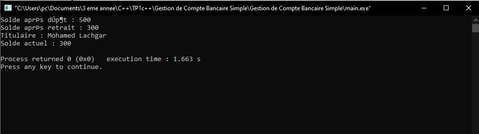
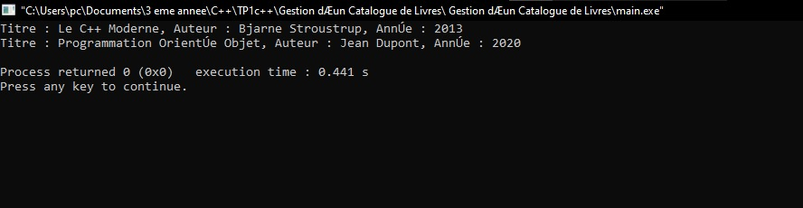

# TP1 – Définition des Classes en C++

##  Objectif pédagogique
Ce TP vise à consolider la compréhension de la **programmation orientée objet (POO)** en C++ à travers la création et la manipulation de classes simples.  
L'étudiant doit être capable de :
- Déclarer une classe et ses attributs.
- Définir des méthodes membres à l’extérieur de la classe à l’aide de l’opérateur de portée `::`.
- Gérer la visibilité (`private`, `public`).
- Manipuler des objets dans la fonction `main()`.

---

##  Exercice 1 : Gestion d’un Compte Bancaire Simple

###  Objectif
Créer une classe `CompteBancaire` permettant de modéliser un compte avec un titulaire et un solde.

###   Spécifications de la classe
**Attributs privés :**
- `std::string titulaire` : nom du titulaire du compte  
- `double solde` : montant disponible sur le compte

**Méthodes publiques :**
- `void definirTitulaire(std::string nom)` — définit le titulaire  
- `void depot(double montant)` — ajoute une somme au solde  
- `void retrait(double montant)` — retire une somme si le solde est suffisant  
- `void afficher()` — affiche le titulaire et le solde

###  Résultat visuel

  
<em>Figure 1 </em>
 

##  Exercice 2 : Gestion d’un Catalogue de Livres
### Objectif

Créer une classe Livre représentant un ouvrage d’une bibliothèque.

### Spécifications de la classe

Attributs privés :

std::string titre

std::string auteur

int anneePublication

### Méthodes publiques :

``void definirLivre(std::string t, std::string a, int annee)``

``void afficher()``

``int getAnneePublication()``

###  Résultat visuel

  
<em>Figure 2 </em>
 

## Concepts abordés

Encapsulation

Méthodes et opérateur de portée ::

Manipulation d’objets

Modularité et lisibilité du code

## Environnement recommandé

Compilateur : GCC / g++ (C++11 ou supérieur)

IDE : Code::Blocks, Visual Studio Code, ou Eclipse CDT
